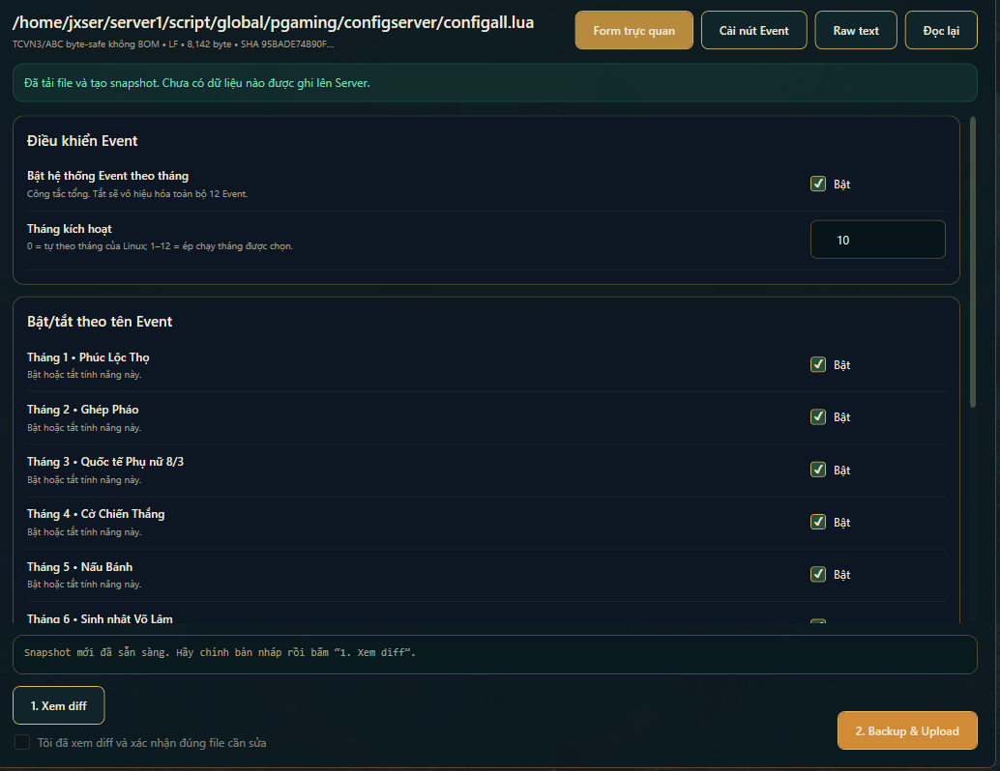

### Một ứng dụng quản lý dành cho JX1 Offline phát triển bởi LT

Server Power · Cấu hình · Vật phẩm · Kỳ Trân Các

**WINDOWS 10 / 11** &nbsp; / &nbsp; **WSL2** &nbsp; / &nbsp; **GIAO DIỆN TIẾNG VIỆT**

[Hướng dẫn cài đặt](INSTALL.md) &nbsp; · &nbsp; [Ghi chú phiên bản](https://github.com/lionesthang45-jpg/JxLTStudio-Releases/releases/tag/v1.2.20) &nbsp; · &nbsp; [Liên hệ hỗ trợ](https://www.facebook.com/lionesthang45/)

**LIONES THẮNG STUDIO**

*Từ khởi động máy chủ đến quản lý dữ liệu game — tập trung trong một giao diện.*

---

## Quản lý tập trung, thao tác rõ ràng

JxLTStudio tập hợp các công cụ quản lý JX1 Offline trên Windows. Giao diện tiếng Việt với tông xanh đậm và vàng đồng giúp bạn làm việc với Server, cấu hình và dữ liệu game trong cùng một ứng dụng.

| Server & vận hành | Dữ liệu & nội dung game |
|---|---|
| **Server Power** — khởi động WSL2, bảng điều khiển Web và tắt an toàn. | **Cấu hình** — form trực quan, Event theo tháng, xem diff và backup trước khi upload. |
| **Server & Client** — tập trung thiết lập kết nối và đường dẫn làm việc. | **Vật phẩm & Kỳ Trân Các** — các công cụ hỗ trợ quản lý mặt hàng và dữ liệu vật phẩm. |
| **Nhật ký hệ thống** — xuất log hỗ trợ để kiểm tra khi có sự cố. | **Lua Studio & công cụ dữ liệu** — hỗ trợ quy trình chỉnh sửa nội dung game. |

## Nhìn gần hơn vào giao diện

**Cấu hình Event theo tháng** · Bố cục chia nhóm, trạng thái dễ đọc và các bước xem diff / backup trước khi ghi dữ liệu.

Ảnh chụp giao diện từ quá trình phát triển; một số chi tiết có thể khác bản đang cài. Ảnh dùng để minh họa bố cục, không phải thiết lập bắt buộc cho Server của bạn.

---

## Chọn bản tải phù hợp

> **1.2.20 · Bản thử nghiệm công khai**
> Bản này đã qua kiểm thử khởi động/tắt WSL2 và bộ cài trên máy phát triển. Chưa hoàn thành thử game qua đêm hoặc xác minh trên mọi cấu hình Windows. Hãy sao lưu dữ liệu trước khi cập nhật.

### JxLTStudio 1.2.20

| Bạn cần gì? | Link tải | Dung lượng |
|---|---|---|
| **Cài lần đầu** — có Tool và Runtime WSL2 | [**TẢI BỘ CÀI ĐẦY ĐỦ**](https://github.com/lionesthang45-jpg/JxLTStudio-Releases/releases/download/v1.2.20/JxLTStudio-Setup-1.2.20.exe) | Khoảng 403 MB |
| **Đã cài Tool** — chỉ cập nhật ứng dụng | [**TẢI BẢN CẬP NHẬT**](https://github.com/lionesthang45-jpg/JxLTStudio-Releases/releases/download/v1.2.20/JxLTStudio-Patch-1.2.20.exe) | Khoảng 34 MB |
| Xác minh file tải | [SHA256SUMS.txt](https://github.com/lionesthang45-jpg/JxLTStudio-Releases/releases/download/v1.2.20/SHA256SUMS.txt) | File văn bản |

[Thông tin phiên bản](https://github.com/lionesthang45-jpg/JxLTStudio-Releases/releases/tag/v1.2.20) · [Hướng dẫn cài đặt](INSTALL.md) · [Liên hệ hỗ trợ](https://www.facebook.com/lionesthang45/)

**Chọn file .exe ở các link trên. Không tải “Source code (zip/tar.gz)” để cài Tool.**

## Bắt đầu trong 3 bước

| 01 · Cài đặt | 02 · Thiết lập | 03 · Vận hành |
|---|---|---|
| Chọn **Setup** nếu cài lần đầu; chọn **Patch** nếu đã có Tool. | Mở **Server Power**, kiểm tra ServerRuntime và khởi động WSL2. Chuẩn bị riêng Server và Client. | Theo dõi trong bảng Web. Khi kết thúc, chọn **Tắt WSL2 an toàn**. |

Đọc [hướng dẫn đầy đủ](INSTALL.md) trước khi nhập dữ liệu Server hoặc nâng cấp. Nếu Windows yêu cầu cài thành phần bổ sung hay khởi động lại, hãy hoàn tất bước đó trước khi tiếp tục.

<strong>Yêu cầu hệ thống và các thành phần cần thiết</strong>

- Windows 10 x64 từ build 19041 hoặc Windows 11 x64, phần cứng hỗ trợ WSL2.
- Bật ảo hóa CPU trong BIOS/UEFI nếu Windows yêu cầu.
- .NET 8 Desktop Runtime x86, Microsoft WebView2 và WSL2. Máy chưa có thành phần cần thiết có thể cần Internet, quyền quản trị và khởi động lại.
- Tối thiểu 8 GB trống để nhập Runtime Linux lần đầu; dữ liệu Server và Client cần thêm dung lượng.
- Chuẩn bị riêng Client và gói Server được phép sử dụng. **Bộ cài không kèm Server jxser.tgz hoặc dữ liệu người chơi.**

## Điểm mới trong 1.2.20

- Sửa cách truyền lệnh Bash sang WSL để tránh lỗi không xác nhận được phiên chạy nền.
- Duy trì phiên WSL nền khi đóng Tool; chống tạo phiên trùng.
- Không tự khởi động lại sau khi người dùng tắt WSL2 an toàn.
- Bổ sung thông tin lỗi của phiên nền; phát hiện WSL dừng trong lúc chờ Web.
- Bộ cài cập nhật ứng dụng và giữ Runtime hiện có.

Đóng cửa sổ Tool **không đồng nghĩa tắt Server**. Khi kết thúc, dùng **Tắt WSL2 an toàn** để chờ lưu dữ liệu và dừng MySQL trước khi đóng WSL.

## Cùng phát triển JxLTStudio

**JxLTAuto đang phát triển**, chưa phải chức năng Auto hoàn chỉnh. Những bạn thường xuyên treo game và muốn tham gia thử nghiệm có thể liên hệ Liones Thắng Studio để trao đổi.

### Cần hỗ trợ?

Liên hệ [Liones Thắng Studio trên Facebook](https://www.facebook.com/lionesthang45/) với phiên bản Tool, mô tả thao tác và ảnh lỗi.

Trong Tool, mở **Nhật ký hệ thống → Xuất log hỗ trợ**. Kiểm tra nội dung trước khi gửi riêng cho người hỗ trợ; không đăng công khai mật khẩu, token, database hoặc thông tin người chơi.

## Về kho này

Kho này chỉ phân phối bộ cài, bản cập nhật và tài liệu; không công khai mã nguồn riêng của JxLTStudio.

Phần khởi động VLTK Offline tích hợp trong Server Power được ghi nhận tác giả **V.D.K**. Các thành phần bên thứ ba giữ bản quyền và điều kiện sử dụng tương ứng.

---

**JxLTStudio · Liones Thắng Studio**

[Tải phiên bản 1.2.20](https://github.com/lionesthang45-jpg/JxLTStudio-Releases/releases/tag/v1.2.20) &nbsp; · &nbsp; [Hướng dẫn](INSTALL.md) &nbsp; · &nbsp; [Facebook](https://www.facebook.com/lionesthang45/)

